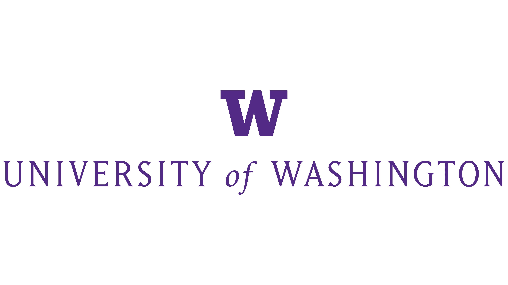
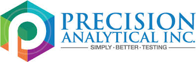
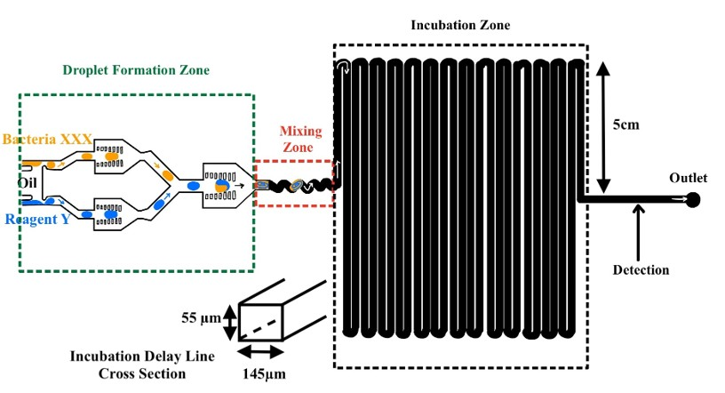
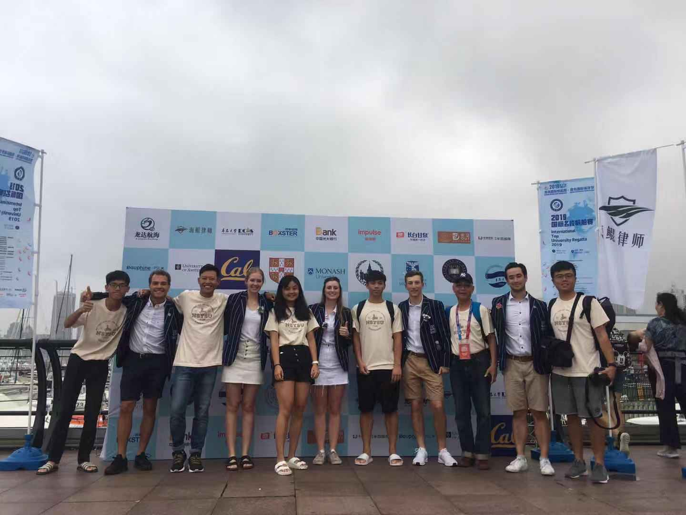

**Email:** tzuchunapply@gmail.com  
**Phone:** +886 989 831 733  
<a href="https://www.linkedin.com/in/tzuchun-huang" style="color: #0969da; font-weight: bold; text-decoration: none;">LinkedIn</a>

---

## SKILLS

**Technical Skills**
Analytical Chemistry
Quality Control(SPC)
Six Sigma
UV-Vis Spectroscopy
Chromatography
Machine Learning
Python
Lynx Automated Liquid Dispensing System
Microsoft Office

**Soft Skills**  
Problem-Solving
Adaptability
Quick Learning
Cross-functional Collaboration

**Languages**  
Mandarin
English

---

## EDUCATION

**University of Washington**, Seattle, WA  
Master of Science in Applied Chemical Science and Technology  
*Dec 2023*  
GPA: 3.53 / 4.0  

 

**National Sun Yat-sen University**, Kaohsiung, Taiwan  
Bachelor of Science in Chemistry  
*Jun 2021*

---

## WORK EXPERIENCE

### Precision Analytical — McMinnville, OR  
**Chemist** | *Nov 2024*

- Quantified creatinine using UV-Vis spectroscopy to normalize urine concentration and performed replicate measurements for routine quality control. Used reference samples and **statistical control limits** (conceptually similar to SPC) to monitor variation and identify abnormal results, supporting efficient and consistent sample processing workflows.  
- Applied **Six Sigma** methodology to investigate significant deviation in patient urine creatinine measurements; analyzed potential causes including sample handling, reagent preparation, and laboratory environment, identified elevated temperature as the primary factor affecting reaction kinetics, implemented SOP improvements to standardize temperature equilibration prior to UV-Vis analysis, and restored consistent measurement performance.  
- Operated the Lynx automated liquid dispensing system and C18 column-based extraction process for high-throughput hormone analysis (androgen, estrogen, progesterone), strictly adhering to **SOPs** to ensure process repeatability and data consistency across urine and saliva samples.  
- Performed methanol recycling to reduce chemical waste and operational costs.

---

## COURSEWORK PROJECTS

### Defect Identification and Classification Using YOLOv5 and Azure Machine Learning
- Trained a defect detection and multiclass classification model using MoS₂ images, applying image preprocessing techniques to enhance defect visibility and reduce noise.  
- Verified detected defects using intensity profile analysis and manual cross-checking to ensure practical validity.  
- Evaluated model performance using precision and recall metrics to assess detection reliability.  
- Awarded **1st place** in a hackathon for technical execution.

### Design Project: Quorum Sensing Behavior Observation
- Designed a microfluidic device to test the hypothesis that quorum sensing behavior can be observed in small populations when confined within limited volumes.

### Machine Learning with Materials Project Database
- Utilized machine learning techniques to predict crystalline structures based on key chemical properties.

---

## Extracurricular Activities

### 2019 International Top University Regatta
- Participated in the 2019 International Top Universities Regatta (ITUR) held at Qingdao Olympic Sailing Center, competing alongside 12 invited teams from prestigious universities worldwide, including Oxford, Cambridge, UC Berkeley, and Tsinghua University.
- The event provided a high-level international exchange platform, combining competitive sailing with cross-cultural collaboration. Through teamwork and strategic sailing, I enhanced my communication, and cross-cultural collaboration skills while engaging with peers from top global universities.

